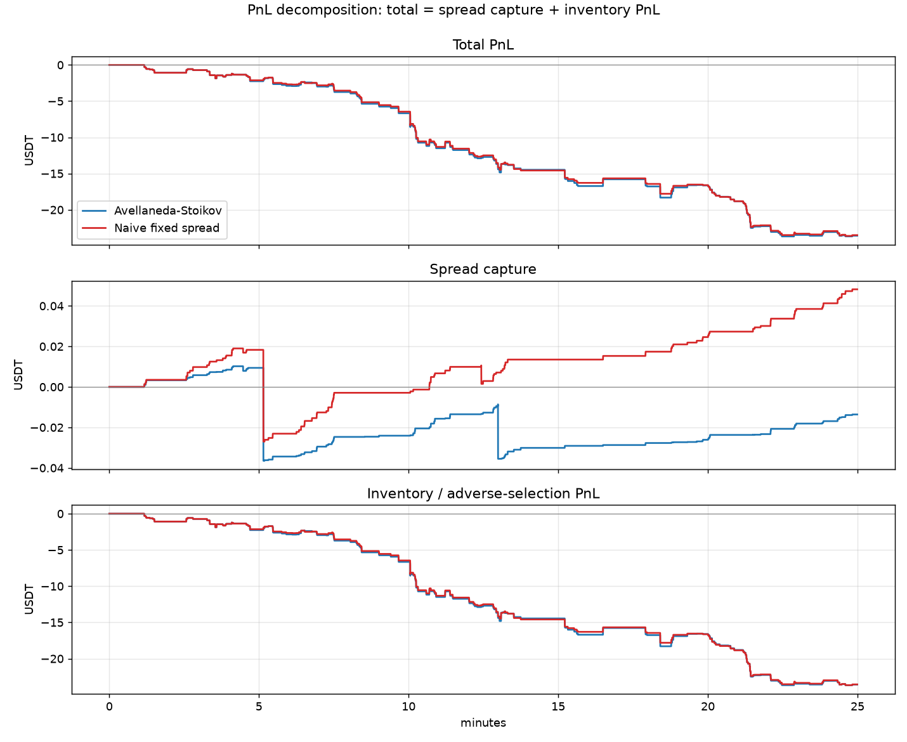
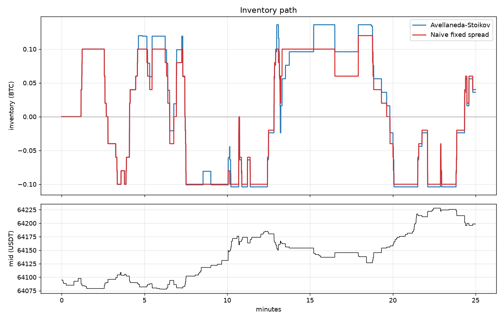
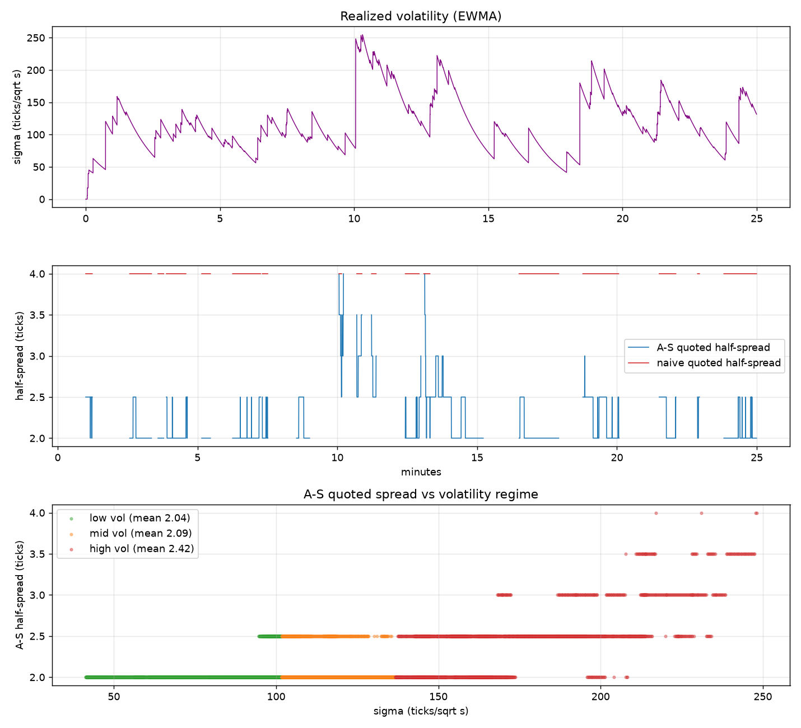

# nanolob

[](https://github.com/Hellblazer704/nanolob/actions/workflows/ci.yml)


A low-latency **limit order book and matching engine** in C++20, with a lock-free
ingest pipeline, real Binance market-data replay validated against exchange
snapshots, and an **Avellaneda–Stoikov market-making simulator** with
queue-position fill modeling on top.

> **33 ns median add-order latency**, p99.9 = 356 ns, **34.8 M ops/s** on mixed
> order flow — on a stock laptop, with every step of the optimization journey
> reproducible from the benchmark suite ([BENCHMARKS.md](BENCHMARKS.md)).

```
 Binance L2 feed         SPSC ring          matching engine        strategy layer
┌────────────────┐     ┌───────────┐     ┌──────────────────┐    ┌────────────────┐
│ depth diffs    │     │ lock-free │     │ price-time       │    │ Avellaneda-    │
│ @100ms         │────▶│ 64.6M     │────▶│ priority         │───▶│ Stoikov  vs    │
│ trades         │     │ items/s   │     │ 33ns adds        │    │ naive baseline │
│ REST snapshots │     │ 16.3M     │     │ zero heap alloc  │◀───│ quotes         │
└────────────────┘     │ msgs/s    │     │ on the hot path  │    └───────┬────────┘
        │              │ end-to-end│     └────────┬─────────┘            │
        │              └───────────┘              │                      ▼
        │                                         │              ┌────────────────┐
        └── validated against ────────────────────┘              │ PnL decomp,    │
            exchange snapshots (17/17 exact)                     │ markouts, plots│
                                                                 └────────────────┘
```

---

## Table of contents

- [Why this exists](#why-this-exists)
- [Phase 1 — the matching engine](#phase-1--the-matching-engine)
- [Phase 2 — performance engineering](#phase-2--performance-engineering)
- [Phase 3 — market replay & validation](#phase-3--market-replay--validation)
- [Phase 4 — market-making simulation](#phase-4--market-making-simulation)
- [Phase 5 — adverse-selection analysis](#phase-5--adverse-selection-analysis)
- [Testing strategy](#testing-strategy)
- [Bugs found (and how)](#bugs-found-and-how)
- [Build & run](#build--run)
- [Repository layout](#repository-layout)
- [Limitations & next steps](#limitations--next-steps)

---

## Why this exists

An order book is the place where price formation actually happens, and a
matching engine is the piece of infrastructure every trading firm runs. This
project builds one properly — not a toy — and then uses it as a laboratory:
replay real exchange flow through it, quote into it with a classical
market-making model, and measure what actually happens to a passive quote.

The engineering constraints were set deliberately: **C++20, no dependencies on
the hot path, no heap allocation while matching, every performance claim
measured rather than asserted, and every correctness claim tested against an
independent oracle.**

---

## Phase 1 — the matching engine

Header-only, zero-dependency, in [`include/nanolob/`](include/nanolob).

### Data structures and why

| Concern | Choice | Why not the obvious thing |
|---|---|---|
| Orders in a price level | Intrusive doubly-linked FIFO list; the `Order` **is** the node | `std::list<Order>` allocates a node per order and adds a pointer hop; intrusive means cancel is an O(1) unlink through a pointer we already have |
| Price levels | Intrusive best→worst linked list **plus** a `price → level*` flat hash map | `std::map` is a red-black tree: a cache-missing pointer chase and an allocation on every new level. Real flow concentrates at the touch, so the sorted-insert walk is ~1–3 hops, and existing levels are found in O(1) by hash |
| Order lookup by id | Custom open-addressing map, linear probing, **backward-shift deletion**, load factor ≤ 0.5 | `std::unordered_map` chains: every lookup is a dependent cache miss, every insert/erase allocates. Tombstones were rejected because order flow is cancel-heavy and probe chains would degrade continuously |
| Memory | Slab pool allocators with an embedded free list, pre-reserved | The system allocator takes locks and occasionally goes long — visible directly in the p99.9 (see below) |
| Event dispatch | Template parameter (`MatchingEngine<Handler>`) | A virtual `IEventHandler` would cost an indirect call per event and block inlining; dead events must cost literally nothing |
| Node layout | `Order` and `PriceLevel` are exactly 64 B (`alignas(64)`, `static_assert`ed) | So a fill touches exactly one cache line, and pool-adjacent nodes can never false-share once the book is read from a second thread |

### Supported semantics

- **Limit GTC** — match while crossing, rest the remainder at the limit price.
- **Limit IOC** — same matching, remainder cancelled (`CancelReason::IocRemainder`).
- **Market** — match until filled or the book is exhausted; remainder cancelled.
- **Cancel** — O(1) unlink; empty levels are torn down automatically.
- **Modify** — quantity reduction *at the same price keeps queue priority*
  (in-place); a reprice or size increase is cancel/replace and correctly loses
  priority, and may match immediately.
- **Self-trade prevention** — `CancelResting`, `CancelIncoming`, or `None`
  (off, for faithful replay).
- **Rejects** — duplicate *live* order id, unknown id, zero quantity. Reusing
  the id of a dead order is allowed, as on real venues.

Prices are integer ticks and quantities integer lots throughout — all decimal
scaling happens once, at the feed boundary. There is no floating point
anywhere in the matching path.

---

## Phase 2 — performance engineering

Full methodology, workload definitions, and the step-by-step journey live in
**[BENCHMARKS.md](BENCHMARKS.md)**. Measured on an Intel Core Ultra 5 225H
laptop (no core pinning, no fixed clocks — a deliberately unglamorous
baseline), GCC 16.1 `-O3`, Google Benchmark, per-op latencies via calibrated
`rdtsc` (Windows `std::chrono` has ~100 ns granularity — useless here).

### The journey — each design point still lives in the suite

| Design point | add p50 | cancel p50 | mixed p99.9 | mixed throughput |
|---|---|---|---|---|
| **0. Textbook baseline** — `std::map` + `std::deque` + `std::unordered_map` | 75 ns | 201 ns | 1.03 µs | 9.1 M/s |
| **1. + intrusive lists, pools, level list** | 44 ns | 41 ns | 601 ns | 25.3 M/s |
| **2. + custom flat hash map** (shipped) | **33 ns** | **30 ns** | **437 ns** | **34.8 M/s** |

Cancel improves **5×** at p50 by design point 1: it becomes hash-lookup →
unlink → pool-free, with no tree walk and no linear scan of the level. The
p99.9 collapse (1.03 µs → 601 ns) is the pool allocators removing the system
allocator from the hot path. Design point 2 then removes the chained map's
dependent cache miss and its per-node allocations.

**Cumulatively: add-order p50 75 → 33 ns, throughput 3.8×, p99.9 down 2–5×.**
The `<1 µs p50` target is met with ~30× margin; even p99.9 is under 0.5 µs.

### An honest negative result

`nanolob_bench_unaligned` compiles the identical engine with the 64-byte node
padding stripped:

| | aligned | unaligned |
|---|---|---|
| add p50 | 33 ns | 32 ns |
| mixed throughput | 34.8 M/s | 33.3 M/s |

**A wash.** Single-threaded, the padding buys nothing measurable. It is kept
for a *concurrency* reason (no false sharing when a strategy thread reads book
state), and the benchmark exists so nobody has to take the folklore on faith.

### Lock-free SPSC ring

[`spsc_ring.hpp`](include/nanolob/spsc_ring.hpp): power-of-two capacity (mask,
not modulo), acquire/release publication, head and tail on separate cache
lines, and **each side caches the other's index** so steady-state push/pop
touches no shared cache line until the cached view goes stale.

| | rate |
|---|---|
| Raw ring, 2 threads | 64.6 M items/s |
| Ring → engine, full mixed flow | 16.3 M msgs/s |

The engine, not the ring, is the bottleneck — which is the correct outcome.
Against Binance replay rates (thousands/s) this is ~4 orders of magnitude of
headroom.

---

## Phase 3 — market replay & validation

### Capture

[`scripts/download_binance.py`](scripts/download_binance.py) records three
streams to one JSONL file: `@depth@100ms` diffs, the trade stream (needed for
queue modeling in phase 4), and periodic REST depth snapshots. It opens the
websocket *before* taking the first snapshot, per Binance's documented
book-management procedure. Public `binance.vision` endpoints — no API key.

### Reconstruction

Binance publishes *level* deltas; the engine speaks *orders*. The
[book mirror](replay/book_mirror.hpp) bridges them: each live price level is
represented by one synthetic order whose quantity is the level's aggregate.

A subtlety worth calling out: within one 100 ms diff, **removals and reductions
are applied across both sides before any additions**. Applied naively (bids then
asks), a batch in which the mid moved up would transiently cross the book and
trigger phantom matches. Removals-first eliminates that for any diff whose end
state is uncrossed — i.e. every real one. This is directly regression-tested.

Sequencing follows the protocol exactly: seed from the snapshot, drop diffs
with `u <= lastUpdateId`, require the first applied diff to straddle
`lastUpdateId+1`, then require `U == prev_u + 1` thereafter.

### Validation — the interesting part

A snapshot's `lastUpdateId` is the final update id of a completed diff batch,
so the moment our applied sequence reaches `last_u == lastUpdateId`, our
reconstructed book **must equal the exchange's own book at that instant**. The
tool compares them directly, top 400 levels per side, price *and* quantity,
exactly — at every snapshot's own sequence point.

That directness matters, and it's a correction to an earlier, weaker design.
The first version seeded a *shadow* book from each snapshot and compared it to
the main book after both consumed ~20 s of diffs. That was too weak: because
diffs carry **absolute** quantities, any two books consuming the same stream
*converge* on the levels it touches, so the check could pass while the main
book was actually wrong at the snapshot instant. Comparing against the
exchange's levels at the exact sequence point removes both the convergence
masking and the settling heuristic. The check is **fault-injection tested**:
dropping 1 in 5000 level updates turns it red (371 mismatches).

**Results across two live BTCUSDT captures (6 min + 25 min), verbatim:**

```
parsed 44516 records (13 snapshots, 14968 diffs, 29535 trades, 0 bad lines)
replay: 14965 diffs applied (3 pre-snapshot skipped, 0 sequence gaps)
mirror: 404782 level updates -> engine, 0 phantom matches
validation: reconstructed book vs exchange snapshot, at the snapshot's own
            sequence point (last_u == lastUpdateId), top 400 levels/side:
  snapshot 97484021786: bid 6407902/6407902 ask 6407903/6407903 | 800 levels, 0 mismatches -> PASS
  ... (12 snapshots)
BOOK RECONSTRUCTION VALIDATED
```

Across both captures: **490k level updates, 0 sequence gaps, 0 phantom
matches, and 17/17 snapshot validations exact** (bid/ask shown are
ours/exchange — they match to the tick).

This was additionally cross-checked against a completely independent
reconstruction written in Python, and directly against raw snapshot level
arrays — all three agree exactly.

---

## Phase 4 — market-making simulation

### Strategies

[`strategies.hpp`](strategy/strategies.hpp) implements **Avellaneda–Stoikov**
with a rolling horizon:

```
reservation r = m − q·γ·σ²·τ
half-spread   = ½·γ·σ²·τ + (1/γ)·ln(1 + γ/k)
```

σ² is a live EWMA variance rate normalized for irregular sampling; τ is a fixed
horizon (the classic finite-horizon `T−t` collapses the book at end-of-day —
for a continuously operating desk a constant τ is the standard adaptation);
inventory `q` is measured in quote-size units. The **naive fixed-spread**
control shares the same size, inventory cap, and no-cross clamping, so the
*only* difference is the quoting policy.

### Fill model — the part that matters

Our quotes are **not** inserted into the mirrored book (diff quantities are
absolute exchange totals; a real insertion would double-count our size against
the next update). Instead each quote is virtual, with its FIFO queue position
estimated from observable flow ([`quote_sim.hpp`](strategy/quote_sim.hpp)):

- On placement we **join the back**: `queue_ahead` = current level quantity.
- Trades at our price **consume the queue ahead first**; only the excess fills us.
- Trades **through** our price ⇒ the level was cleared ⇒ we fill in full.
- Level shrinkage that trades don't explain is **cancellations**, prorated:
  `queue_ahead -= cancelled × (queue_ahead / level_qty)` — the standard neutral
  assumption, since a canceller's queue position is unobservable.
- Level **growth joins behind us** and never improves our position.
- If the opposite best crosses our price, we're filled in full (we got run over).

### Results — 25 minutes of live BTCUSDT

PnL decomposes exactly: `total = spread capture + inventory PnL`, where spread
capture is summed per fill as `qty × (mid_at_fill − price)` signed toward us,
and inventory PnL is the residual — the mark-to-market drift of held inventory.

| | A–S | naive fixed spread |
|---|---|---|
| Fills | 529 | 183 |
| Volume traded | 3.04 BTC | 2.68 BTC |
| Avg edge at fill | +0.79 ticks | +2.40 ticks |
| Realized edge @30 s | **−887 ticks** | **−759 ticks** |
| Spread capture | −0.01 USDT | +0.05 USDT |
| Inventory PnL | −23.57 USDT | −23.56 USDT |
| **Total PnL** | **−23.59 USDT** | **−23.51 USDT** |
| Mean \|inventory\| | 0.083 BTC | 0.076 BTC |



The session **rallied ~104 USDT** (64095 → 64199). Both quoters were
repeatedly lifted on their offers — A–S sold 296 times against 233 buys —
leaving them short into the rise. Result: a few *cents* of spread capture
sitting next to ~**23 USDT** of inventory loss.

**That ratio is the entire lesson.** Spread capture is pennies; inventory is
dollars. A passive quoting policy's real job is inventory control, not edge
capture. Neither strategy "wins" here, and presenting one as a winner off a
single trending session would be exactly the kind of overfitting this
decomposition exists to expose.





---

## Phase 5 — adverse-selection analysis

[`analysis/adverse_selection.ipynb`](analysis/adverse_selection.ipynb)
(executed, outputs committed).

A market maker's fill is **not a random sample of time** — it is a sample
conditioned on someone aggressive choosing to trade with *you*. Two
measurements:

**1. Markouts.** The signed mid move after a fill,
`markout(Δ) = d·(m_{t+Δ} − m_t)`, plus the realized edge
`d·(m_{t+Δ} − p_fill)`:

| horizon | A–S markout | naive markout |
|---|---|---|
| 1 s | −417 ticks | −470 ticks |
| 5 s | −676 ticks | −630 ticks |
| 30 s | −888 ticks | −761 ticks |

The curve slopes down and keeps sloping: the mid systematically walks away from
whatever we just accumulated, and the ~1–2 ticks of edge captured at the fill
are annihilated within a second.

**2. Fill rate vs subsequent midprice move.** Classify every 100 ms step by
whether a quote filled within the next second, then compare the *subsequent 5 s
mid move*, signed toward the position the fill creates:

| | not filled | filled | gap |
|---|---|---|---|
| A–S | +21 ticks | −530 ticks | **−551** |
| naive | +18 ticks | −578 ticks | **−596** |

**That gap is adverse selection, in ticks.** When we don't get filled, the mid
drifts mildly in our favor; conditional on being filled, it moves hard against
us. A–S's slightly smaller gap is consistent with it requoting toward its
reservation price and shedding inventory, rather than sitting still to be
picked off — but with one session, that's a hypothesis, not a finding.

These magnitudes are large partly because of real BTCUSDT microstructure: at a
0.01 tick on a ~64,000 price the book is *sparse* (verified against raw
snapshots: gaps of 1, 1, 8, 28 ticks below the touch), so the BBO sits still
and then gaps hundreds of ticks — and our quotes get run over precisely when it
gaps.

---

## Testing strategy

**54 test cases, ~6.1M assertions**, Catch2. `ctest --test-dir build`.

### The centerpiece: randomized differential testing

[`test_differential.cpp`](tests/test_differential.cpp) generates 20k-operation
random streams — all order types, IOCs, markets, modifies, cancels of live and
junk ids, few participants so STP fires constantly, drifting mid so levels
churn — and feeds the **identical** stream to both the real engine and a
deliberately naive `std::map`/`std::deque` reference engine. After *every*
operation the appended event suffix must match exactly; periodically the full
book state (BBO, depth at many prices, per-order remaining quantity, open
count) is cross-checked too. Run across multiple seeds × all three STP
policies.

This is the strongest correctness evidence in the repo: any divergence in
matching, priority, STP, modify, or level-teardown logic surfaces within a few
thousand operations. The reference engine is reused as the phase-2 baseline, so
it can't silently rot.

### Unit and property tests

<details>
<summary><b>Engine semantics — 24 cases</b> (click to expand)</summary>

Empty-book BBO · resting orders set the BBO · aggressive limit fills better
prices first · **FIFO time priority within a level** · partial fill leaves the
maker resting · unmatched GTC remainder rests **at its limit price, not the
last trade price** · IOC cancels its remainder · fully-filled IOC emits no
cancel · non-crossing IOC cancels in full · market order sweeps multiple levels
· market order on an empty book · cancel tears down empty levels · cancel of a
*middle* order keeps the FIFO intact · **modify reducing qty keeps queue
priority** · **modify increasing qty loses it** · modify changing price can
match immediately · modify to zero cancels · modify of unknown id rejects ·
duplicate live ids reject but dead ids may be reused · zero-qty rejects · STP
CancelResting keeps matching behind the cancelled order · STP CancelIncoming
leaves the resting order untouched · STP None allows self-match · book rebuilds
across heavy add/cancel churn

</details>

<details>
<summary><b>Data structures — 10 cases</b></summary>

**Flat hash map**: basic insert/find/erase · growth past initial capacity ·
`for_each` visits every live entry · `reserve` avoids rehash ·
**200k-operation randomized churn cross-checked against `std::unordered_map`
on a deliberately small key space** — this targets backward-shift deletion,
whose failure mode is a corrupted probe chain making some key silently
unreachable · a **maximal-collision variant** (48-key space forcing long
wrap-around probe chains) that runs a full reachability sweep *after every
erase* · a **full random drain** that empties a 20k-key table in shuffled
order, checking survivors stay reachable as the table empties.

**Pool**: distinct objects + LIFO storage recycling (verified by address) ·
`reserve` pre-grows so no slab allocation occurs during the run ·
over-aligned types get correctly aligned storage.

</details>

<details>
<summary><b>SPSC ring — 3 cases</b></summary>

Single-threaded fill/drain/full/empty edges and 1000 rounds of wraparound ·
**2,000,000-item cross-thread transfer asserting strict FIFO with no loss and
no duplication** · `FeedMsg` payloads survive intact.

</details>

<details>
<summary><b>Replay — 4 cases</b></summary>

`parse_fixed` decimal→tick scaling (short fractions padded, extra digits
truncated, negatives and garbage rejected) · all three record types parse,
**with local `ts` and exchange `E` deliberately 1400 ms apart so reading the
wrong clock fails** · book mirror reconstructs through snapshot + diffs and is
**idempotent** on re-applied diffs · **removals-are-applied-before-additions**
regression: a diff where the mid moves up must not phantom-match.

</details>

<details>
<summary><b>Strategy — 10 cases</b></summary>

Queue sim: trades consume the queue ahead before filling us · trade *through*
our price fills the remainder · trades on the other side/price don't touch us ·
cancellations shrink the queue pro rata · trades and cancels interleave
consistently · book crossing our quote fills it. Strategy: variance estimator
tracks the true scale of mid moves · **A–S reservation price skews against
inventory** (long ⇒ both quotes shift down) · **A–S spread widens with
volatility** · strategies never cross the market and respect inventory caps.

</details>

### Continuous integration

Every push runs [six jobs](.github/workflows/ci.yml):

| Job | What it guards |
|---|---|
| build & test (gcc) | correctness |
| build & test (clang) | portability, second opinion on UB |
| **ASan + UBSan** | the full suite — including the differential tests — under sanitizers |
| **ThreadSanitizer** | the lock-free ring's cross-thread test — ASan/UBSan can't see data races, only TSan can |
| **clang-tidy** | `bugprone-*` and `clang-analyzer-*` as **errors** |
| **coverage gate** | fails under **85%** engine line coverage (currently **100%**) |

The coverage gate uses a [custom script](scripts/coverage_gate.py) rather than
gcovr: gcovr 8.x counts each template *instantiation's* line records separately
when merging across translation units, so a header instantiated in one TU shows
every other method's lines as uncovered — it reported 34% for a file with
genuinely 100% coverage. The script merges gcov JSON by `(file, line)` across
all TUs, the way lcov does.

---

## Bugs found (and how)

Kept here deliberately — the interesting part of a project like this is what
the verification actually caught.

| Bug | Found by | Impact |
|---|---|---|
| **Use-after-free in STP** — `maker->id` was read after the order was returned to the pool | GCC `-Wmaybe-uninitialized` on the very first build | Real memory bug on the STP `CancelResting` path |
| **CSV precision** — `ostream`'s default 6 *significant* digits quantized a 6.4e6-tick mid onto a 10-tick grid, erasing every sub-0.10-USDT move | Noticing the exported `mid_ticks` (`6.40948e+06`) disagreed with the exact integer `best_bid`/`best_ask` columns in the same row | Corrupted the exported series the analysis reads; the simulation itself was always full-precision |
| **Mixed clocks** — fills carried Binance's exchange trade time `T` while book updates carried the capture host's local clock, measured **1.44 s behind** the exchange | A 1-second markout of −526 ticks was physically implausible for quotes sitting 1–5 ticks off the mid | Every fill-relative horizon skewed by 1.44 s; fixing it moved the 1 s markout to −417 ticks and median queue wait from 5.6 s to 4.2 s |
| **Notebook merge misalignment** — `merge_asof` returns a fresh `RangeIndex`, so an unsorted left frame silently misaligns results | Code review while chasing the clock bug | Latent; would have corrupted markouts on any capture with out-of-order fills |
| **Validation false failure** — comparing *all* levels flagged mismatches on deep levels that diffs simply never touch (a structural property of diff-based reconstruction, not drift) | First validation run: 3/5 FAIL | Fixed by bounding the comparison to the top 400 levels per side |
| **Validation too weak** — the shadow-book design let both books *converge* on the diff-touched levels, so it could pass while the main book was wrong at the snapshot instant | Auditing *why* the check passed, then confirming a stronger check (compare against the exchange's own levels at the exact sequence point) also passes — and that fault injection turns it red | Weak test, not a product bug; replaced with the direct sequence-point comparison now shipping |

The book reconstruction itself was verified three independent ways before the
phase-4 numbers were trusted: against exchange REST snapshots (17/17 exact),
against a from-scratch Python reconstruction, and against raw snapshot level
arrays.

---

## Build & run

Requires CMake ≥ 3.23, a C++20 compiler, and Ninja. Catch2 and Google Benchmark
are fetched automatically; **the engine itself has no dependencies**.

```sh
cmake -S . -B build -G Ninja -DCMAKE_BUILD_TYPE=Release
cmake --build build
ctest --test-dir build --output-on-failure
```

```sh
# benchmarks: all design points + the ring
./build/bench/nanolob_bench
./build/bench/nanolob_bench_unaligned --benchmark_filter="nanolob/"

# capture ~10 min of live BTCUSDT L2 + trades   (pip install websockets)
python scripts/download_binance.py --minutes 10 --out data/btcusdt.jsonl

# reconstruct the book and validate it against the exchange's own snapshots
./build/replay/nanolob_replay data/btcusdt.jsonl

# market-making simulation, both strategies, then plots
./build/strategy/nanolob_mmsim --capture data/btcusdt.jsonl --strategy as    --out-prefix results/as
./build/strategy/nanolob_mmsim --capture data/btcusdt.jsonl --strategy naive --out-prefix results/naive
python scripts/plot_mm.py                        # pip install matplotlib pandas

# adverse-selection analysis
jupyter lab analysis/adverse_selection.ipynb
```

Sanitizer and coverage builds:

```sh
cmake -S . -B build-asan -G Ninja -DCMAKE_BUILD_TYPE=Debug -DNANOLOB_SANITIZE=ON
cmake -S . -B build-tsan -G Ninja -DCMAKE_BUILD_TYPE=RelWithDebInfo -DNANOLOB_TSAN=ON
cmake -S . -B build-cov  -G Ninja -DCMAKE_BUILD_TYPE=Debug -DNANOLOB_COVERAGE=ON
cmake --build build-cov && ctest --test-dir build-cov
python scripts/coverage_gate.py build-cov --threshold 85
```

(ASan/UBSan/TSan need a Linux or macOS toolchain — the sanitizer runtimes are
not shipped with the MinGW build used on Windows; CI runs them on Linux.)

`nanolob_mmsim` flags: `--strategy as|naive`, `--size`, `--gamma`, `--k`,
`--tau`, `--qmax`, `--half-spread`, `--warmup`.

---

## Repository layout

```
include/nanolob/          the engine — header-only, no dependencies (847 lines)
  types.hpp                 integer tick/lot domain types, enums
  pool.hpp                  slab pool allocator, embedded free list
  flat_hash_map.hpp         open addressing, backward-shift deletion
  book.hpp                  Order / PriceLevel / BookSide / OrderBook
  engine.hpp                matching, STP, order lifecycle
  spsc_ring.hpp             lock-free SPSC ring buffer
  feed.hpp                  32-byte FeedMsg + dispatch
  testing/reference_engine.hpp   naive oracle (differential tests + bench baseline)

tests/                    54 Catch2 cases
bench/                    Google Benchmark suite, all design points (469 lines)
replay/                   Binance parser, book mirror, validating replay tool (552 lines)
strategy/                 A-S + naive, queue-position fill sim, PnL decomp (520 lines)
scripts/                  capture, plots, coverage gate (358 lines)
analysis/                 executed adverse-selection notebook
BENCHMARKS.md             the optimization journey, with methodology and caveats
```

Captured market data (`data/*.jsonl`) and generated `results/` are gitignored —
regenerate them with the downloader; the committed notebook preserves the
analysis outputs.

---

## Limitations & next steps

Stated plainly, because a simulation that doesn't disclose its assumptions is
marketing rather than research:

- **Single-threaded matching core.** By design — the SPSC ring is the
  concurrency boundary. No persistence, no recovery, no multi-symbol sharding.
- **No fees or rebates.** Maker rebates and taker fees dwarf 1–2 tick edges in
  practice; every PnL number here would move materially.
- **No latency model.** Quotes update on the next 100 ms diff; a real desk has
  wire latency, and a real exchange has a queue that doesn't wait for you.
- **Queue proration is a neutral guess.** Cancel positions are unobservable
  from L2 data; the analysis inherits that uncertainty.
- **No self-impact.** Our fills would have changed the book that generated
  them.
- **A–S parameters are demo-scaled, not calibrated.** `k` in particular could
  be estimated from the captured trade stream rather than fixed.
- **Single sessions, one symbol.** The results above are one sample. The
  framework makes multi-session, multi-regime sweeps cheap — that plus a
  γ/τ frontier sweep and a fee model is the obvious next work.

Benchmarks are from a laptop with no core pinning or clock fixing; ratios
between design points are stable run-to-run, absolute numbers move a few
percent. Latency samples carry ~6–10 ns of `rdtsc` overhead that is **not**
subtracted.
